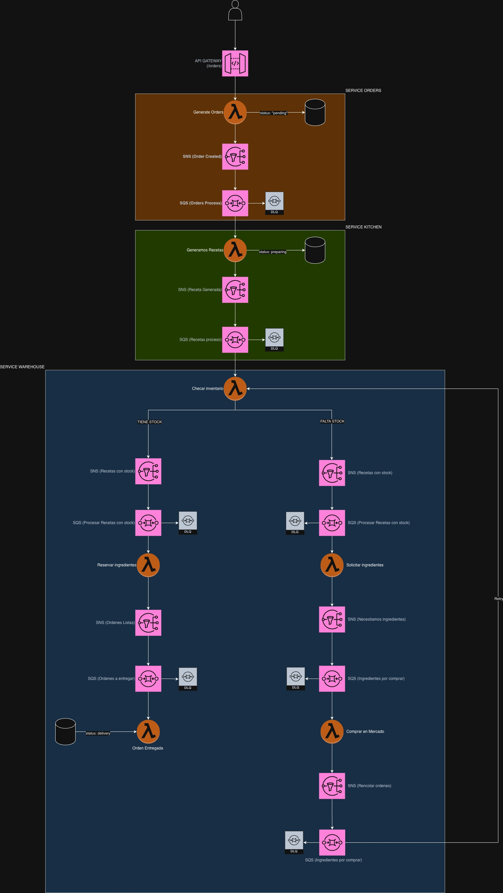

# 🍽️ Reto Serverless — Sistema de Restaurante

Sistema event-driven para gestionar el ciclo completo de una orden de restaurante: desde que el cliente la crea hasta que llega a su mesa. Construido sobre AWS con arquitectura serverless, DDD y comunicación asíncrona via SNS/SQS.

---

# 📦 Servicios

El sistema está dividido en 4 servicios independientes, cada uno desplegable por separado usando `serverless-compose`.

### 🧾 Orders
Punto de entrada del sistema. Recibe las órdenes del cliente y las publica al pipeline de procesamiento.

| Método | Endpoint | Descripción |
|--------|----------|-------------|
| `POST` | `/orders` | Crea una nueva orden (status: `pending`) |
| `GET`  | `/orders` | Lista todas las órdenes |

### 🍳 Kitchen
Se encarga de asignar una receta a cada orden y exponer el catálogo de ingredientes y recetas disponibles.

| Método | Endpoint | Descripción |
|--------|----------|-------------|
| `GET`  | `/recipes` | Lista las recetas disponibles |
| `GET`  | `/ingredients` | Lista el stock actual de ingredientes |
| `POST` | `/ingredient` | Agrega o actualiza un ingrediente |

### 🏭 Warehouse
El corazón del sistema. Verifica el inventario, reserva ingredientes, compra al mercado si hay escasez y marca la orden como entregada.

> No expone endpoints HTTP — opera completamente via eventos SQS.

### 🤖 Artificial Intelligence
Usa Groq AI para recomendar recetas basándose en los ingredientes disponibles en ese momento.

| Método | Endpoint | Descripción |
|--------|----------|-------------|
| `GET`  | `/recommend-recipe` | Genera 6 recetas recomendadas con IA y las guarda en DynamoDB |

---

# 🔄 Flujo de una orden

```
POST /orders
  → Orden creada (status: pending)
  → Kitchen asigna una receta (status: preparing)
  → Warehouse verifica el inventario
      ├── Hay stock → Reserva ingredientes → Orden entregada (status: delivered)
      └── Falta stock → Compra al mercado → Reintenta verificación
```

Toda la comunicación entre servicios es asíncrona usando **SNS FIFO + SQS FIFO**. Cada cola tiene su propio DLQ con alarma en CloudWatch para detectar fallos.

---

# ♾️ Limitantes
- Las variables de entorno están embebidas en la configuración de Serverless por practicidad (lo ideal sería usar AWS Secrets Manager o `.env`)
- El servicio de IA requiere las siguientes variables en el entorno al desplegar:
  - `GROQ_API_URL`
  - `GROQ_API_KEY`
  - `GROQ_MODEL`
  - `RESTAURANT_AI_API_URL`

---

# 💻 Usar en local

1. Instalar dependencias en la raíz
```bash
npm install
```

2. Ingresar al servicio que quieras levantar
```bash
cd ./src/services/{orders|kitchen|warehouse|artificial-intelligence}
```

3. Levantar las funciones con hot-reload
```bash
npm run start
```

> Los servicios corren de forma independiente. Si un servicio depende de otro (ej. kitchen necesita que orders esté corriendo), levántalos en terminales separadas.

---

# 🚀 Desplegar

1. Estar en la raíz del proyecto
2. Configurar las credenciales de AWS
```bash
aws configure
```

3. Ejecutar el deploy completo (despliega los 4 servicios en orden)
```bash
npm run deploy
```

> El deploy usa `serverless-compose` para orquestar el orden de despliegue. Si solo quieres desplegar un servicio en particular, entra a su carpeta y corre `npm run deploy` desde ahí.

---

# 🧼 Mejoras a aplicar
* Mejorar tema de permisos, por practicidad se decidio agregar los permisos desde serverless. Pero considero que esto sea controlador por equipo de DevOps y Arquitectura
* Mejor uso de DatabaseAdapter. Se puede mejorar para poder conectar cualquier tipo de de datos. Por cuenta free se decicio usar DynamoDB
* Agregar capa de validaciones por schema en request
* .....

# ✨ Adicionales
* Se agregan test unitarios para tener seguridad
* Se configura un pre-commit para validar que todos los test pasen correctamente y permitir el commit

# 👷 Arquitectura Serverless

